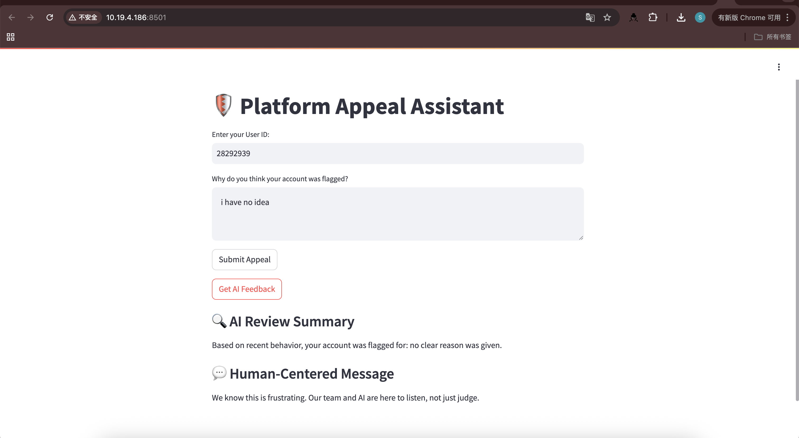
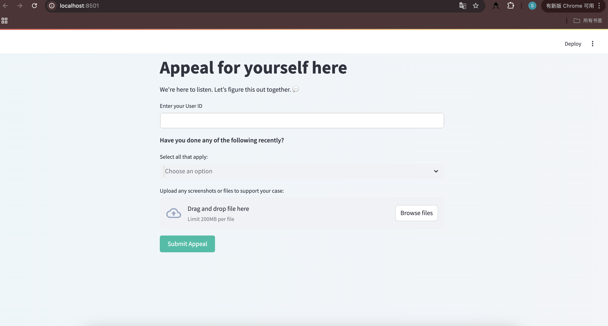
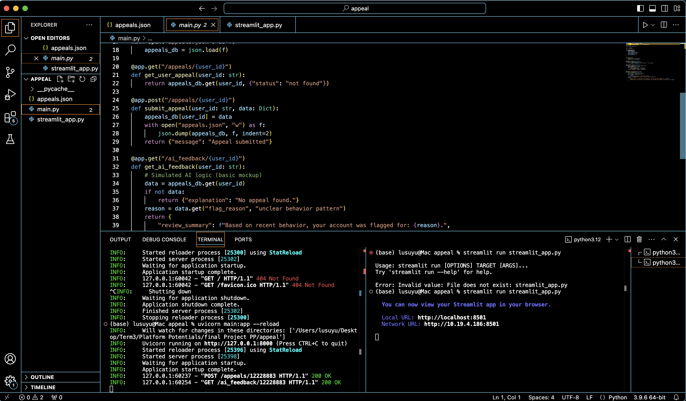
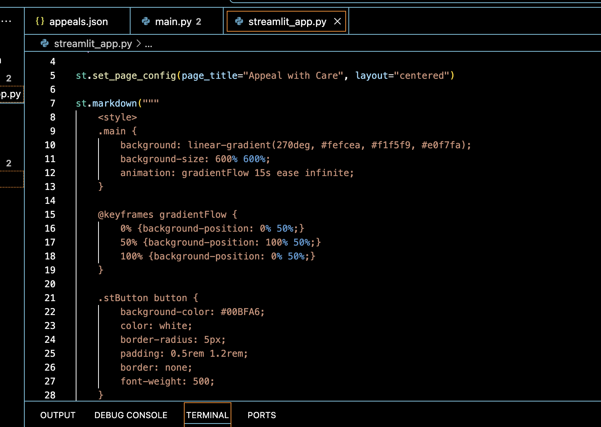
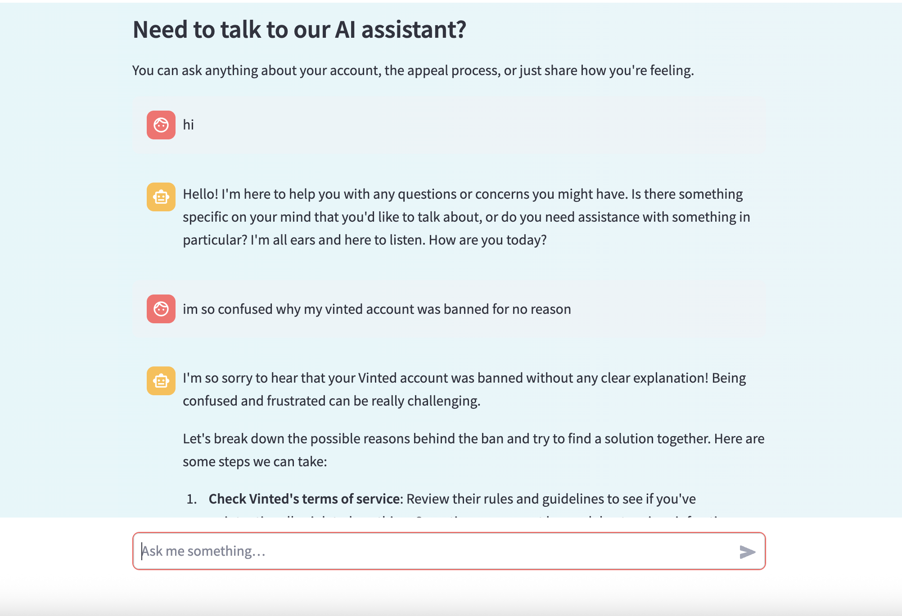

# Vinted Appeal Assistant

A human-centered account appeal assistant that helps users challenge wrongful bans and receive emotional support when facing opaque automated moderation.

## Project Overview

**Vinted Appeal Assistant** is an interactive system built with Streamlit and FastAPI, integrating local AI (via Ollama) to simulate a more transparent and empathetic appeal process. It was developed in response to the inequality between users and platforms like Vinted, where account suspensions often happen with little explanation.

### Key Features

- High-fidelity UI screens (Account Banned, Violation Details, Appeal Progress, Feedback History)
- AI-generated explanations based on user behavior and tone-sensitive feedback
- Upload feature for submitting screenshots or evidence
- Integrated AI chatbot for emotional support and answering user questions

## Tech Stack

- **Frontend:** Streamlit (custom styled with CSS)
- **Backend:** FastAPI (REST API)
- **Data Layer:** JSON file simulating a database
- **AI Integration:** Ollama running LLaMA3.2 model

## File Structure

- `streamlit_app.py` – Main UI and chat interface  
- `main.py` – FastAPI backend for appeal handling  
- `appeals.json` – Simulated local database  
- `README.md` – Project documentation  

## How to Run

1. **Install dependencies**:

pip install streamlit fastapi uvicorn requests

2. **Start backend**:

uvicorn main:app --reload

3. **Start frontend**:

streamlit run streamlit_app.py

4. **Run Ollama model** (LLaMA3.2):

ollama run llama3.2

## System Goals

- Challenge the imbalance of power between platforms and users  
- Provide transparency and feedback during moderation decisions  
- Offer warmth, support, and dignity in the appeal experience

## Feature Testing & Development Logs
During development, I iterated on both frontend and backend features to ensure usability and emotional clarity for users:

Initial layout test for user input fields and emotional prompt.

Improved version with user-centered copy and refined button states.

FastAPI integration test: appeal submission and AI feedback endpoints.

Dynamic background gradient and button hover logic implemented for visual warmth.

AI chatbot prototype using Ollama (LLaMA3.2), simulating caring responses in chat.

## References

- Vinted user ban case studies and complaints  
- Mozilla Foundation – *Privacy Not Included*  
- Caroline Sinders – *Trust & Safety UX Checklist*  
- Academic readings on platform fairness and AI ethics  

## Disclaimer

This is a conceptual prototype for academic purposes only.  
Created by Suyu Lu (UAL)
Student Id:24000975
